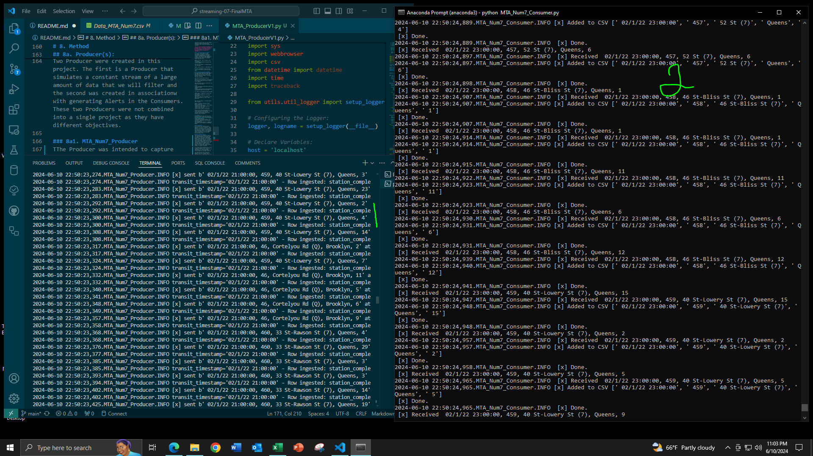

# streaming-07-Final
> Created by: A. C. Coffin | Date: 07 June 2024 | 
> NW Missouri State University | CSIS: 44671-80/81: Data Streaming | Dr. Case

# Overview: 
Weekly approximately 5.5 million people use the Subway in New York City, annually the number of passengers recorded in 2019 was 1.598 billion. The NYC Subway system has a total of  24 subway lines and 472 stations throughout Manhattan, Brooklyn, Queens, and the Bronx with a staggering 665 miles of mainline track. The Subways in New York are a lifeline for residents and businesses, they operate 24 hours a day, 7 days a week. It's one of the busiest transportation systems with a complex network of tracks, stops, and hubs running throughout 4 of the 5 Boroughs. 

This project was designed to collect data from a modified CSV file that will be streamed through RabbitMQ, a message broker to simulate filtering and collecting data from a data stream. There are several goals that we will be fulfilling:

* Pulling only data we are interested in: transit_timestamp, station_complex_id, station_complex, borough, ridership.
* Filtering the data to sort data into CSV's based on the Line a subway station is on.
* Creating an alert for when a station is busy based on the number of passengers at it for Flushing-Main St.
* Creating another alert for if a station is busy for Hunters Point Ave. 

Two of these will require windowing to create alerts, and the first will be an example of collecting data and exporting it to CSV. 
Traditionally Log files are not uploaded to GitHub, however, as this is a streaming project these logs have been left as a way to demonstrate the success of the project.

## ProducerV2/ConsumeV2(s)
**Screenshot Key:**
1. MTA_ConsumeLine7V2.py Code
2. Terminal: MTA_LineQV2.py
3. Terminal: MTA_ProducerV2.py
4. Terminal: MTA_Line5V2.py
5. RabbitMQ Admin Panel
6. Terminal: MTA_Line7V2.py


# Table of Contents
1. [File List](File_List)
2. [Machine Specs](Machine_specs)
3. [Prerequisites](Prerequisites)
4. [Before you Begin](Before_you_begin)
5. [Data Source](Data_Source)
    * [About the NYC Subway System](About_the_NYC_Subway_System)
6. [Modifications of Data](Modifications_of_Data)
7. [Creating an Environment & Installs](Creating_an_Enviroment_&_Installs)
8. [Method](Method)
    * [8a1. MTA_producerV1](8a1._MTA_ProducerV1)
    * [8a2. MTA_ProducerV2](8a2._MTA_ProducerV2)
    * [8a3. MTA_ProducerV3](8a3._MTA_ProducerV3)
    * [8b1. MTA_ConsumerV1](8b1._MTA_ConsumerV1)
    * [8b2. MTA_ConsumeV2 Group](8b2._MTA_ConsumeV2_Group)
    * [8b3. ConsumerV3](8b3._ConsumerV3)
9. [Executing the Code](Executing_the_Code)
    * [9a. ProducerV1/ConsumerV1](9a._ProducerV1/ConsumerV1)
    * [9b. ProducerV2/ConsumerV2](9b._ProducerV2/ConsumerV2)
    * [9c. ProducerV3/ConsumerV3](9c._ProducerV3/ConsumerV3)
10. [Results](Results)
11. [References](References)

# 1. File List
| File Name | Repo Location | Type |
| ----- | ----- | ----- |
| util_about.py | utils folder | python script |
| util_aboutenv.py | utils folder | python script |
| util_logger.py | utils folder | python script |
| Subway Map.pdf | Maps folder | PDF |
| SubwayMap.PNG | Maps folder | PNG |
| v2_emitter_of_tasks.py | BaseCode_Samples folder | python script |
| v2_listenining_worker.py | BaseCode_Samples folder | python script |
| requriements.txt | main repo | text doc |
| MTA_SubwayW1Feb22.csv | main repo | CSV |
| Data_MTAAlerts.csv | main repo | CSV |
| aboutenv.txt | utils\util_outputs | text |
| util_about.txt | utils\util_outputs | text |
| MTA_ConsumerV1.py | main repo | python script |
| MTA_ProducerV2.py | main repo | python script |
| MTA_ConsumeLine5V2.py | main repo | python script |
| MTA_ConsumeLine7V2.py | main repo | python script |
| MTA_ConsumeLineQV2.py | main repo | python script |
| MTA_ProducerV3.py | main repo | python script |
| MTA_ConsumeV3.py | main repo | python script |
| Data_MTA_Num7.csv | Output CSV (V1, V2)/Output_Data_ConsumeV1 | CSV |
| Data_MTA_Line5.csv | Output CSV (V1, V2)/Output_Data_ConsumeV2(s) | CSV |
| Data_MTA_Line5.csv | Output CSV (V1, V2)/Output_Data_ConsumeV2(s) | CSV |
| Data_MTA_LineQ.csv | Output CSV (V1, V2)/Output_Data_ConsumeV2(s) | CSV |
| MTA_ConsumeLine5V2.log | logs | log |
| MTA_ConsumeLine7V2.log | logs | log |
| MTA_ConsumeLineQV2.log | logs | log |
| MTA_ProducerV2.log | logs | log |
| MTA_ProducerV3.log | logs | log |
| MTA_ConsumeV3.log | logs | log |

# 2. Machine Specs
 Date and Time: 2024-06-07 at 02:15 PM
 Operating System: nt Windows 10
 System Architecture: 64bit
 Number of CPUs: 12
 Machine Type: AMD64
 Python Version: 3.12.3
 Python Build Date and Compiler: main with Apr 15 2024 18:20:11
 Python Implementation: CPython
 Active pip environment:   None
 Active conda environment: None
 Terminal Environment:        VS Code
 Terminal Type:               cmd.exe
 Preferred command:           python
 
# 3. Prerequisites
1. Git
2. Python 3.7+ (3.11+ preferred)
3. VS Code Editor
4. VS Code Extension: Python (by Microsoft)
5. RabbitMQ Server Installed and Running Locally
6. Anaconda Installed

# 4. Before you Begin
1. Fork this starter repo into your GitHub.
2. Clone your repo down to your machine.
3. View / Command Palette - then Python: Select Interpreter
4. Select your conda environment.

# 5. Data Source

The Metropolitan Transportation Authority(MTA) is responsible for all public transport in New York City and collects data in batches by the hour. This batching creates counts for the number of passengers boarding a subway at a specific station. It also provides data concerning payment, geography, time, date, and location of moving populations based on stations. This data was collected from February 2022 to May 4, 2024. 

MTA Data is readily available from New York State from their Portal.

NYC MTA Data for Subways: https://data.ny.gov/Transportation/MTA-Subway-Hourly-Ridership-Beginning-February-202/wujg-7c2s/about_data

## 5a. About the NYC Subway System

The New York City Subway system has 24 subway lines and 472 stations throughout Manhattan, Brooklyn, Queens, and the Bronx. Staten Island does not have a subway system, but a ferry system and an above-ground train. The lines are listed in the chart based on their Line Reference. Some Lines have local express services that share a line but stop at different stations. For the full MTA Subway Map view [Subway Map.pdf](Maps/Subway%20Map.pdf).

In 2019 an average of 5.5 million people ride the subway weekly. According to the MTA, the annual ridership was 1.598 billion people in 2019. There are seven numbered routes and 15 letter routes, not including the shuttles. The system consists of 6,684 subway cars and 665 miles of mainline track. 

| Line Reference | Line Name | Area of NYC |
| ----- | ----- | ----- |
| 1, 2, 3 | Red Line | Runs along the west side of Manhattan |
| 4, 5, 6 | Green Line | East side of Manhattan and parts of the Bronx |
| 7 | Flushing Line | Connects manhattan to Queens |
| A, C | Blue Line | Runs from norther Manhattan through Brooklyn |
| B, D | Orange Line | Connects Manhattan to Brooklyn |
| E, F, M | Purple Line | Serves Queens and Manhattan |
| G | Light Green Line | Connects Brooklyn and Queens |
| J, Z | Brown Line | Runs through Brookelyn and into Queens |
| L | Gray Line | Connects Manhattan and Brooklyn |
| N, Q, R | Yellow Line | serves Manhattan, Brooklyn and Queens |
| S | 42nd Street Shuttle | Short Shuttle line in Manhattan |
| W | White Line | Runs between Manhattan and Queens |
| Z | Jamaica Line | Connects Brooklyn and Queens |


In 2019 the Busiest subway stations according to the MTA were as Follows:
| Rank | Station/Complex | Lines | Annual ridership |
| ----- | ----- | ----- | ----- |
| 1 | Times Sq-42St/42 St | N, Q, R, W, S, 1, 2, 3, 7, A, C, E | 65,020,294 |
| 2 | Grand Central-42 St | S, 4, 5, 6, 7 | 45,745,700 |
| 3 | 34 St-Herald Sq | B, D, F, M, N, Q, R, W | 39,385,436 |
| 4 | 14 St-Union Sq | L, N, Q, R, W, 4, 5, 6 | 32,385,260 |
| 5 | Fulton St | A, C, J, Z, 2, 3, 4, 5 | 27,715,365 |
| 6 | 34 St-Penn Station | 1, 2, 3 | 25,967,676 |
| 7 | 34 St-Penn Station | A, C, E | 25,631,364 |
| 8 | 59 St-Columbus Circle | A, B, C, D, 1 | 23,040,650 |
| 9 | Chambers St, WTC /Park Pl/Cortlandt | A, C, E, 2, 3, R, W | 20,820,549|
| 10 | Lexington Av-53 St/51 St | E, M, 6 | 18,957,465 |


# 6. Modifications of Data
A secondary file containing the data utilized in this repo is located in the main repo. This variation of the altered file was modified by selecting data from week 1 of February 2022. The first week of February 2022 data was selected, as it contained an example of several stations multiple times. Due to the file size, the original file can not be uploaded to Git Hub. 

A column was added containing the Line information each station is part of. Stations with multiple connections to different lines were added based on whether the line they were part of was already part of the majority of the others. For example, if a station served Lines 7, N, and W, it was added to Line-7_queue. By doing this, it limited the number of queues that were created to 3 queues, as opposed to creating a queue per station.

A Second File was created from the data collected in Data_MTA_Line7.csv containing only information on Station-447(Flushing-Main St (7)) and Station-463(Hunters Point Av (7)) to generate alerts as to how busy a particular station was. This was done in response to project time constraints.

# 7. Creating an Environment & Installs
Before beginning this project two environments were made, one as a VS Code environment and the other as an Anaconda environment. RabbitMQ requires the Pika Library to function, to ensure that the scripts execute and create an environment in either VS Code or Anaconda.

While the Anaconda Environment is not necessary for this project it was utilized to ensure that the environments between VS Code and Anaconda were consistent when running the Producers and Consumers.

**If you have an Anaconda environment that contains Pika or have Pika installed on the base be sure to activate that Env. For this example, I will be using my previously created Anaconda Env - RabbitEnv.**

## 7a. Creating VS Code Environment
To create a local Python virtual environment to isolate our project's third-party dependencies from other projects. Use the following commands to create an environment, when prompted in VS Code set the .venv to a workspace folder and select yes.
```
python - m venv .venv # Creates a new environment
.venv\Scripts\activate # Activates the new environment
```
Once the environment is created install the following:
```
python -m pip install -r requirements.txt
```
For more information on Pika see the [Pika GitHub](https://github.com/pika/pika)

## 7b. Creating Anaconda Environment
To create an Anaconda environment open an Anaconda Prompt, the first thing that will pop up is the base. Then we are going to locate our folder, to do this type the following:
```
cd Dcuments\folder_where_repo_is\ 
cd Documents\ACoffinCSIS44671\streaming-07-Final # This is where the file is located on my computer
```
Once the folder has been located the line should look like this:
```
(base) C:\Users\Documents\folder_where_repo_is\streaming-07-Final>
(base) C:\Users\Tower\Documents\ACoffinCSIS44671\streaming-07-Final> # My File Path
```
To create an environment do the following:
```
conda create -n RabbitEnv # Creates the environment
conda activate RabbitEnv # Activates Environment
This will create the environment, if you want to deactivate it, enter: conda deactivate
```

Once the environment is created execute the following:
```
python --version # Indicates Python Version Installed
conda config --add channels conda-forge # connects to conda forge
conda config --set channel_priority strict # sets priority
install pika # library installation
```
Be sure to do each individually to install Pika in the environment. You have to use the forge to do this with Anaconda. Each Terminal should look similar to the following:

# 8. Method
In this assignment base code that was developed by Dr. Case in her repository, "[streaming-04-multiple-consumers](https://github.com/denisecase/streaming-04-multiple-consumers)" was utilized in combination with previous work completed in "streaming-04-bonus-ACoffin". Examples of base codes can be found in the BaseCode folder. For quick navigation see the following sections:

* [8a1. MTA_producerV1](8a1._MTA_ProducerV1)
* [8a2. MTA_ProducerV2](8a2._MTA_ProducerV2)
* [8a3. MTA_ProducerV3](8a3._MTA_ProducerV3)
* [8b1. MTA_ConsumerV1](8b1._MTA_ConsumerV1)
* [8b2. MTA_ConsumeV2 Group](8b2._MTA_ConsumeV2_Group)
* [8b3. ConsumerV3](8b3._ConsumerV3)

## 8a. Producer(s):
Each section explains a different Producer developed for this project. All of the producers have a sleep time set to every 60 seconds. Since the original data is generated hourly, using 60 seconds as a sleep time will simulate the passage of time with each second representing a minute that passes. 

* [8a1. MTA_producerV1](8a1._MTA_ProducerV1)
* [8a2. MTA_ProducerV2](8a2._MTA_ProducerV2)
* [8a3. MTA_ProducerV3](8a3._MTA_ProducerV3)

### 8a1. MTA_ProducerV1
This script was designed to collect only specific aspects of information from the stream. In this instance, the objective was to collect data about transit_timestamp, station_complex_id, station_complex, borough, and ridership. This initial producer demonstrates the ability of the user to select specific columns, without having to collect all of the data. The queue name used was Num7Sub_queue, this was due to its existence and use with a previous project. The Consumer was specifically designed to delete the queue and then reaccess it, ensuring that there wasn't data contamination.

#### Selecting Columns
Rather than reading the entire stream into the queue instead, we selected our columns based on their number and assigned variables to them.

```
for row in reader:
                # Seperate row into variables by column:
                #transit_timestamp, transit_mode, station_complex_id, station_complex, borough, payment_method, fare_class_category, ridership, transfers, latitude, longitude, Georeference = row
                transit_timestamp=row[0]
                station_complex_id = row[2]
                station_complex = row[3]
                borough = row[4]
                ridership = row[7]

                # logging the row being ingested
                logger.info(f'{transit_timestamp=} - Row ingested: {station_complex_id=}, {station_complex=}, {borough=}, {ridership=}')
```
Once these rows were pulled from the CSV, they were formatted into a string that would allow us to capture only those variables:

```
# Pulling the desired info
                message =(f" {transit_timestamp}, {station_complex_id}, {station_complex}, {borough}, {ridership}").encode() 
                send_message(host, "07-Line", message)
                logger.info(f"[x] sent {message} at {transit_timestamp} to {Num7Sub_queue}")
```
As this file is very long, a KeyboardInterrupt was added, as well as FileNotFoundError and a Value error, allowing us to gracefully handle issues and escape the Producer should we need to.

### 8a2. MTA_ProducerV2
The second producer was more complex in design, as it was created to sort the data from the stream into bins based on which subway line the station was part of. 

The function `send_message` in this code is identical to the one developed by Dr. Case in the Base Code provided. See the BaseCode_Samples folder for more information.

### main function
The main function was structured to read the csv file, create a record of reading the file, create a queue based on the subway line, and then add the data to the queue based on the line.

The read function in this example is structured differently, as the information was formatted to be pickled, a different format of encoding. By using pickle we are serializing the data and storing it in a binary. In this instance because there is a large amount of data in a complex format - a mix of data types. A pickle allows us to serialize the data and later reconstruct it into the original Python object. 

**Note, careful with pickles, if a source is untrusted do not unpickle the data as it creates the chance that it will execute arbitrary code**

```
with open(input_file_name, 'r', newline='') as input_file:
        reader = csv.reader(input_file)
        next(reader)
        # reading rows from csv
        for row in reader:
            subway_data = {
                'transit_timestamp': row[0],
                'transit_mode':row[1],
                'station_complex_id':int(row[2]),
                'station_complex':row[3],
                'Line':row[4],
                'borough':row[5],
                'payment_method': row[6],
                'fare_class_category': row[7],
                'ridership':row[8],
                'transfers':int(row[9]),
                'latitude':row[10],
                'longitude':row[11],
                'Georeference':row[12]

                }
                # logging the row being ingested
            logger.info(f'{subway_data["transit_timestamp"]} - Row ingested: {subway_data["station_complex_id"]}, {subway_data["station_complex"]}, {subway_data["Line"]}, {subway_data["ridership"]}')
```
Next, we sort subway_data into queues based on the subway Line and pack the message into a pickle before sending it.

```
# select queue depending on line
            queue = 'Line-' + subway_data['Line'] + '_queue'

            # pack message contents with pickle
            message = pickle.dumps(subway_data)
            send_message('localhost', queue, message)
            logger.info(f"[x] send_message('localhost', {queue}, {subway_data['transit_timestamp']}, {subway_data['station_complex_id']}, {subway_data['Line']}, {subway_data['ridership']})")
```
Similar to the other Producer, a KeyInterrrupt was added. This addition was to ensure that if the user terminated the process early it was handled properly and didn't result in unusual terminal readings or an improper disconnect. 

## 8a3. MTA_ProducerV3
This Producer was designed to read the CSV file "Data_MTAAlerts.csv" and then send the messages to separate queues: "Station-447" and "Station-463". Similar to sending the messages to the other two Consumers a connection was made to RabbitMQ similar to the base code, and the queues were declared and made durable. The main difference in this method was that structs were used.

Structs were selected as it was an encoding technique I struggled with previously, and are not as sensitive to version changes as pickles are. When handling a struct the data has to be handled in a specific way, especially timestamps. 

```
# Converting timestamp to "%m/%d/%y %H:%M"
transit_timestamp = datetime.strptime(transit_timestamp_str, "%m/%d/%y %H:%M:%S")
```

Once the timestamps are converted, then it is possible to execute the following:

```
# Using an f string to send data with timestamp to send data to Station447_queue
                #message = (f"{Station447_queue} Reading = {transit_timestamp}; Ridership = {Station447}").encode()
                message = struct.pack('=QI', int(transit_timestamp.timestamp()), int(Station447))
                send_message(host, "Station-447", message)
                logger.info(f'[x] Sent: {message} to {Station447_queue}')
```

## 8b. Consumer(s)
This project contains multiple consumers, each was designed to output a CSV but decodes the message using different processes. For example "MTA_ConsumerV1.py" uses `decode()` whereas the V2 series of Consumers uses pickling. 

* [8b1. MTA_ConsumerV1](8b1._MTA_ConsumerV1)
* [8b2. MTA_ConsumeV2 Group](8b2._MTA_ConsumeV2_Group)
* [8b3. ConsumerV3](8b3._ConsumerV3)

### 8b1. MTA_ConsumerV1
This Consumer is designed to decode the data collected from MTA_ProducerV1.py and then splits the original message into sections using ','. It allows us to prepare the message to be added to a CSV file for later use.

The following function was used to write the data to the CSV file:
```
with open ('Data_MTA_Num7.csv', 'a', newline='') as file:
        writer = csv.writer(file)
        writer.writerow(message)
        logger.info(f'[x] Added to CSV {message}')
```
Once the message has been processed from the queue, the consumer is instructed to delete the queue, ensuring that no messages remain inside before the Producer adds a new message. Additionally to prevent the miss handling of messages auto_ack was set to false, to ensure the messages were handled before deletion of the queue. 

```
channel.queue_delete(queue=qn)
channel.queue_declare(queue=qn, durable=True)

# prefetch_count = Per consumer limit of unacknowledged messages      
channel.basic_qos(prefetch_count=1) 

# and do not auto-acknowledge the message (let the callback handle it)
channel.basic_consume( queue=qn, on_message_callback=callback, auto_ack=False)
```

### 8b2. MTA_ConsumeV2 Group
Each Consumer is designed to be run with "MTA_ProducerV2.py". The consumers were created separately to output individual CSVs to prevent confusion when determining if the data in the queue was going to the correct Output CSV. The same base is utilized, but the name of the output file and queue names were changed to pull the subway line data from each queue.

#### Reason Behind Separate Consumers
Using separate Consumers was also made based on fault tolerance, parallel processing, and resource isolation. Only one computer was used to determine how to handle fault tolerance when writing a CSV is a major issue. By separating the consumers if a single consumer fails, due to a resource issue, the other consumers can continue processing. Additionally, by allocating the CPU time we can give the CSV writer more I/O resources while the data processor requires a larger amount of CPU. Finally, because each consumer is entering a different thread and working in a separate queue, it isolates each process and prevents interference between them.

#### callback
Since the Producer utilizes pickles to serialize the data and allow us to sort it.

```
# decode the binary message body to a string
    subway_data = pickle.loads(body)
    logger.info(f'{subway_data["transit_timestamp"]},'
                    f'{subway_data["transit_mode"]},'
                    f'{subway_data["station_complex_id"]},'
                    f'{subway_data["station_complex"]},'
                    f'{subway_data["Line"]},'
                    f'{subway_data["borough"]},'
                    f'{subway_data["fare_class_category"]},'
                    f'{subway_data["ridership"]},'
                    f'{subway_data["transfers"]},'
                    f'{subway_data["latitude"]},'
                    f'{subway_data["longitude"]},'
                    f'{subway_data["Georeference"]}')
```
Once each line is unpickled, then the data is written to a CSV. The process is a little more complex in this case and requires the use of DictWriter, and the addition of writing "column_headers". 
```
# Write the filtered data into a new file
    with open ('Data_MTA_LineQ.csv', 'a', newline='') as file:
        writer = csv.DictWriter(file, fieldnames=column_headers)
        if file.tell() == 0:
            writer.writeheader()
        # Process each message
        writer.writerow(subway_data)
```
By using `if file.tell() == 0`, we are dictating that if the file is empty to have the writer adds the "column_headers". The information for "column_headers" is listed under variables.

**Alerts Generated:**


#### main
There were a few alterations made to `main`. The first is that the consumer is instructed to delete the queue before declaring it. Deleting the queue prevents data that may not be cleared the queue from interfering with the information processed by the Consumer and then added to the associated CSV. The following line was added to prevent the Consumer from deleting the queue before processing the message. 
```
channel.basic_consume( queue=qn, on_message_callback=callback, auto_ack=False)
```

### 8b3. ConsumerV3
The average number of passengers for each station:
 Station 463 = 85.916 or 86 passengers
 Station 447 = 988.024 or 989 passengers
These numbers were found doing a basic Excel Average, and for our purposes, we will be using these numbers to determine what we consider as busy for a station. To create our alerts and with the Average in mind we will be using the following:
Station 463 is busy if passengers > 100
Station 447 is busy if passengers > 1000

The following dequeue lengths were used as the objective was to determine if a station was busy every three hours, which meant a total of 8 readings in the deque.
```
Station447_deque = deque(maxlen=8) 
Station463_deque = deque(maxlen=8)
```
#### Callback Functions
Each station was given an individual callback function. This allows us to run through the messages and generate an alert based on the number of passengers in each deque. The first step of this is to unpack the data.
```
# Clean the body of the message to find the temperature:
    body_decode = struct.unpack('=QI',body)
    transit_timestamp, Station447 = body_decode
    
    # Converst the timestamp back to a string for logging
    transit_timestamp_str = datetime.fromtimestamp(transit_timestamp).strftime("%m/%d/%y %H:%M")
    logger.info(f"[Station 447]: {transit_timestamp_str}: {Station447} Passengers")
```
Once the data was unpacked the following logic was applied to determine if the station was busy.
```
if len(Station447_deque) == Station447_deque.maxlen:
        if Station447_deque[0] - Station447 >= 1000:
            Station447_change = Station447_deque[0] - Station447
```
Finally based on the response a notification was generated. 
#### main function
This function was designed to connect to RabbitMQ. Once connected it will delete the queue and create a queue. After establishing the prefetch_count, the way the channel was to consume the messages was added.

```
channel.basic_consume( queue="Station-447", on_message_callback=Station447_callback, auto_ack=False)
channel.basic_consume( queue="Station-463", on_message_callback=Station463_callback, auto_ack=False)
```
Finally, the exception handling was added, along with the entry point, which focuses on the main.

# 9. Executing the Code
Please go to each subsection before execution for the process on how to execute the Producer and Consumer Pairs. Follow each of the steps carefully as there is a function built into the consumers to delete the queue before establishing the connection. Each Consumer MUST be run first.

* [9a. ProducerV1/ConsumerV1](9a._ProducerV1/ConsumerV1)
* [9b. ProducerV2/ConsumerV2](9b._ProducerV2/ConsumerV2)
* [9c. ProducerV3/ConsumerV3](9c._ProducerV3/ConsumerV3)

## 9a. ProducerV1/ConsumerV1
1. Open 1 Anaconda Prompt Terminal
2. In the terminal set the file path to where the repo sits. Use the following structure to access this file path:
```
cd Dcuments\folder_where_repo_is\ 
cd Documents\ACoffinCSIS44671\streaming-07-Final # This is where the file is located on my computer
```
3. Activate the created RabbitEnv within the terminal.
```
conda activate RabbitEnv
```
The terminal should look similar to this:


4. In the Anaconda terminal run the Consumer "MTA_ConsumerV1.py"
```
python MTA_ConsumerV1.py
```
5. In a VS Code terminal using the previously activated .venv execute the following:
```
MTA_ProducerV1.py
```

Allow the code to run through the lines of the CSV. Remember that the process must be interrupted in the terminal containing the Consumer as it will not terminate on its own. If escape on the Prodcuer is necessary use Ctrl + C.

**Screenshot Key:**
1. Producer Terminal
2. Consumer Terminal


## 9b. ProducerV2/ConsumerV2 
This process is more involved and involves a larger number of open terminals. For this section be sure to follow the instructions carefully. 
1. Open 3 Anaconda Prompt Terminals
2. In each of the 3 terminals set the file path to where the repo sits. Use the following structure to access this folder path:
```
cd Dcuments\folder_where_repo_is\ 
cd Documents\ACoffinCSIS44671\streaming-07-Final # This is where the file is located on my computer
```
3. Activate the created RabbitEnv within each terminal.
```
conda activate RabbitEnv
```
The Anaconda terminal should look like the following:


4. Open a terminal in VS Code and make sure the venv is active.
5. In the first Anaconda Prompt Terminals run: `python MTA_ConsumeLine5V2.py`
6. In the second Anaconda Prompt Terminal run: `python MTA_ConsumeLine7V2.py`
7. In the third Anaconda Prompt Terminal run: `python MTA_ConsumeLineQV2.py`
8. In the VS Code Terminal run: `python MTA_ProducerV2.py`

Allow the code to run through the lines of the CSV, the Producer will close on its own but remember to close each of the Consumer terminals. If an escape from the Producer is requried use Ctrl + C.

## 9c. ProducerV3/ConsumerV3
1. Open 1 Anaconda Prompt Terminal
2. In the terminal set the file path to where the repo sits. Use the following structure to access this file path:
```
cd Dcuments\folder_where_repo_is\ 
cd Documents\ACoffinCSIS44671\streaming-07-Final # This is where the file is located on my computer
```
3. Activate the created RabbitEnv within the terminal.
```
conda activate RabbitEnv
```
The terminal should look similar to this:


4. In the Anaconda terminal run the Consumer "MTA_ConsumeV3.py"
```
python MTA_ConsumerV1.py
```
5. In a VS Code terminal using the previously activated .venv execute the following:
```
MTA_ProducerV3.py
```

Allow the code to run through the lines of the CSV. Remember that the process must be interrupted in the terminal containing the Consumer as it will not terminate on its own. If escape on the Prodcuer is necessary use Ctrl + C.

# 10. Results
Using multiple consumers on a complex data stream can be beneficial when handling massive amounts of data. It's important to note that each Consumer set was designed to execute a specific series of tasks to produce a CSV output. While the process of writing a CSV is not complex to code, it can be labor-intensive for a computer. The outputs for each of the scripts can be found in the Output CSV(V1, V2). The Producer and Consumers were run in stages while being developed as tests. For those screenshots please see the "ScreenShots" folder.

**Screenshot Key:**
1. MTA_ConsumeLine7V2.py Code
2. Terminal: MTA_LineQV2.py
3. Terminal: MTA_ProducerV2.py
4. Terminal: MTA_Line5V2.py
5. RabbitMQ Admin Panel
6. Terminal: MTA_Line7V2.py


**Alerts Generated by V3**
Screenshot Key:
1. Producer Terminal
2. Consumer Terminal


# 11. References
- MTA Subway Data from NYC Open Portal, Downloaded: 04 May 2024: [https://data.ny.gov/Transportation/MTA-Subway-Hourly-Ridership-Beginning-February-202/wujg-7c2s/about_data](https://data.ny.gov/Transportation/MTA-Subway-Hourly-Ridership-Beginning-February-202/wujg-7c2s/about_data)
- MTA (14 April 2020). Subway and Bus Facts 2019 Facts. Accessed: 07 June 2024: https://new.mta.info/agency/new-york-city-transit/subway-bus-facts-2019 
- Pika Documentation: [Pika GitHub](https://github.com/pika/pika)
- M4 Streaming multiple consumers by accoffin12: [streaming-04-multiple-consumers](https://github.com/accoffin12/streaming-04-multiple-consumers)
- M4-Bonus Repo Exploring MTA Data by accoffin12:   [streaming-04-bonus-ACoffin](ttps://github.com/accoffin12/streaming-04-bonus-ACoffin)
- M4 Streamining Multiple Consumers by Dr. Case: [streaming-04-multiple-consumers](https://github.com/denisecase/streaming-04-multiple-consumers)


